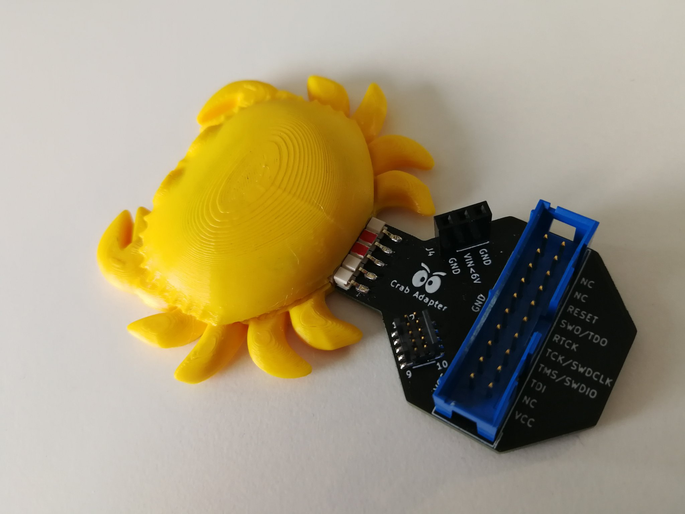

## Hack the Crab



Use probe-rs projects to flash the crab firmware:

### cargo-flash

Install cargo flash:

```
cargo install cargo-flash
```

With your ST-Link probe attached to the crab, run:

```
cargo flash --chip stm32g030J6Mx --release
```

### cargo-embed

Or, even simpler, use cargo-embed:

Install cargo embed:

```
cargo install cargo-embed
```

With your ST-Link probe attached to the crab, run:

```
cargo embed --release
```